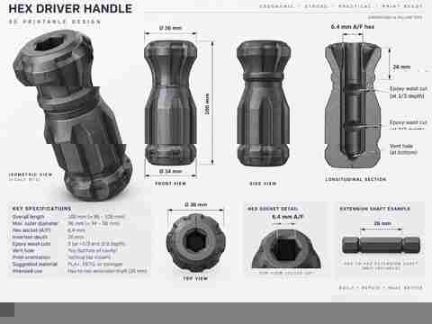

# Hex handles

A family of compact 3D-printable handles for nominal **1/4-inch (6.35 mm) hex-to-hex extension shafts**.

The design direction comes from earlier hand-made/mesh-finished handles and the concept artwork below: chunky angular geometry, broad ribs, pronounced collars, and a short body reinforced by the metal shaft through most of its length.

## Design target

- **32 mm maximum overall handle length**
- nominal **26 mm metal shaft** embedded through most of the handle
- **6.4 mm flat-to-flat** CAD socket for a nominal 1/4-inch hex shaft
- two internal epoxy reservoirs at approximately **1/3 and 2/3 socket depth**
- continuous tail vent so trapped air and displaced adhesive can escape during assembly
- print with the **hex opening on the build plate**
- support-free geometry designed around a printer capable of approximately **65° overhangs from vertical**
- strong, broad, angular grip features rather than rounded cosmetic fillets
- fine surface texture intentionally omitted from CAD so it can be applied later as a mesh modifier

## Versions

| Version | Length | Ribs | Main change |
|---|---:|---:|---|
| [v1 — 32 mm five-rib angular handle](v1-32mm-five-rib/) | 32 mm | 5 | First accepted design: hard-edged five-rib body, deep 26 mm shaft reinforcement, epoxy reservoirs, and tail vent |

## Current design

*The V1 presentation above is rendered directly from the committed STL; the concept artwork remains the styling reference.*

The concept art is a styling reference rather than a dimensional drawing. The accepted V1 deliberately compresses the idea into a much shorter body so the metal extension shaft reinforces roughly **81% of the handle length**.

See also:

- [Design history](../../docs/hex-handles-design-history.md)
- [Printing and installation notes](../../docs/hex-handles-printing.md)
