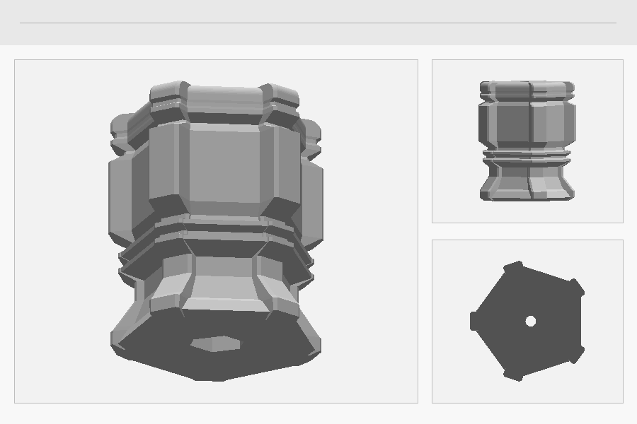

# v1 — 32 mm five-rib angular hex handle

The first accepted hex-handle design: a short, chunky handle for a nominal **26 mm hex-to-hex extension shaft**, rebuilt around the concept artwork's broad hard-edged ribs rather than the smoother eight-rib geometry used in discarded prototypes.

## Exterior geometry

- overall length: **32.0 mm**
- nominal circumscribed envelope parameter: **28 mm**
- measured exported-STL extents: approximately **26.17 × 27.52 × 32.00 mm**
- **5 ribs**, spaced **72°** apart
- rib crest width: **3.6 mm**
- broad planar recessed panels between ribs
- piecewise-linear shoulders and polygonal double collar
- no general body fillets
- only the exposed tail tip uses a **1.4 mm** comfort roundover

Fine surface texture is intentionally excluded from the CAD. It can be added after export with a mesh modifier without changing the functional socket geometry.

## Shaft socket

- nominal socket: **6.4 mm flat-to-flat**
- nominal shaft length: **26 mm**
- full-size socket depth: **26.3 mm**, including **0.3 mm seating allowance**
- two outward epoxy reservoirs centred at:
  - **8.77 mm** from the mouth
  - **17.53 mm** from the mouth
- reservoir size: **8.8 mm AF**
- reservoir flat land: **1.6 mm**
- reservoir transition chamfer: **1.4 mm** at each end
- continuous axial vent: **2.4 mm diameter**
- tail vent exit: **3.6 mm diameter** with a **0.65 mm** chamfer

The epoxy features expand outward from the 6.4 mm shaft path; they do not create inward projections that could block insertion.

## Mouth-down printing

The STL is oriented with the **hex opening at Z = 0**, directly on the build plate, and the rounded tail at Z = 32 mm.

After the 26.3 mm full-size socket, a **2.0 mm tapered roof** closes toward the vent rather than ending in an abrupt horizontal socket floor. The accepted mesh was checked at approximately **61.83° maximum non-bed downward overhang from vertical**, within the stated 65° printer capability.

Changing the exterior envelope, socket depth, roof taper, or other major geometry may invalidate that overhang result and should be rechecked in the slicer.

## Assembly

Dry-fit the metal shaft first. For permanent installation, place a controlled amount of epoxy in the bore/reservoir region, keep the vent clear, and insert the shaft slowly so air and displaced adhesive can escape through the tail.

The design has **not** been assigned a torque rating. Physical shaft fit, adhesive performance, layer adhesion, and torque strength depend on material, print settings, printer calibration, and the chosen shaft.

## Validation

The accepted STL was checked as a **single connected watertight body** after mesh processing. The 6.4 mm shaft path, five-rib count, epoxy-reservoir positions, continuous vent, overall 32 mm length, and mouth-down orientation were also checked during development.

Physical print and destructive torque testing remain to be performed.

## Files

- `hex_handle_32mm_5rib_v1.scad` — parametric OpenSCAD source
- `hex_handle_32mm_5rib_v1.stl` — printable handle mesh, generated from the source
- set `output = "socket_coupon"` in the source to generate a full-depth socket-fit coupon
- set `output = "section"` for a non-printable half-model inspection view
